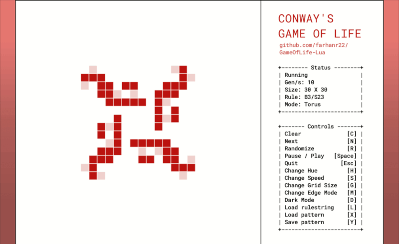

<p align="center" style="margin-bottom: 0px !important;">
  
</p>
<h1 align="center">GameOfLife-Lua</h1>

A feature-rich, interactive Conway's Game of Life visualizer written in Lua, using the LÖVE framework. Designed as a fun, flexible sandbox for exploring various cellular automata.

<p align="center">
  
</p>

### Features

-   **Interactive! :** Drag your mouse across the grid or click individual cells to toggle their state.
-   **RLE Pattern Support :** Import patterns from the clipboard and export your creations back in the standard Run-Length Encoded (RLE) format.
-   **Custom Rulesets :** Go beyond Conway's classic `B3/S23` rule; the app supports any rule in the B/S notation, allowing you to explore a vast universe of different cellular automata.
-   **Multiple Grid Modes :** Choose between a `torus` (wrapped edges) or a `finite plane` (bounded edges) to observe different pattern behaviors.
-   **Simulation Controls :** Change the grid size and simulation speed on the fly.
-   **Adjustable Visuals :** Toggle dark/light mode, cycle through UI colors and resize the window if you feel like it.

    
## Getting Started

### For Windows

1.  Download the [`GameOfLife-Lua-windows.zip`](https://github.com/farhanr22/GameOfLife-Lua/releases/latest/download/GameOfLife-Lua-windows.zip) file.
2.  Extract the contents of the zip file.
3.  Open the extracted folder and run `GameOfLife-Lua.exe`.

> [!NOTE]
> If you have LÖVE installed, you can run it by simply downloading the [`GameOfLife-Lua.love`](https://github.com/farhanr22/GameOfLife-Lua/releases/latest/download/GameOfLife-Lua.love) file and double-clicking on it OR by running `love path\to\GameOfLife-Lua.love`.


### For Linux & macOS

1.  **Install the LÖVE framework.** You can download it from the [official website](https://love2d.org/) or install it using your system's package manager (e.g., `sudo apt install love` on Debian/Ubuntu).

2. **Download** the [`GameOfLife-Lua.love`](https://github.com/farhanr22/GameOfLife-Lua/releases/latest/download/GameOfLife-Lua.love) file.

3.  **Run the app** from your terminal :
    ```
    love /path/to/GameOfLife-Lua.love
    ```

  
## Controls

### Basic Controls

Drag your mouse across the grid or click on cells to toggle their state.

| Key     | Action                                         |
| :------ | :--------------------------------------------- |
| `Space` | Pause or resume the simulation.                |
| `C`     | Clear the entire grid.                         |
| `N`     | Advance the simulation by one step (when paused). |
| `R`     | Randomize the grid with a new built-in pattern.  |
| `Esc`   | Quit the application.                          |

### Options & Customization

| Key     | Action                                         |
| :------ | :--------------------------------------------- |
| `D`     | Toggle between Dark and Light mode.            |
| `H`     | Cycle through different colors.                |
| `S`     | Cycle through different simulation speeds.     |
| `G`     | Cycle through different grid sizes.            |
| `M`     | Toggle the edge wrapping mode (`Torus` / `Bounded`). |

### Pattern & Rule Management

| Key     | Action                                         |
| :------ | :--------------------------------------------- |
| `Y`     | **Export** the current pattern to the clipboard (RLE format). |
| `X`     | **Import** a pattern from the clipboard (RLE format).         |
| `L`     | **Import** a custom rulestring (e.g., `B3/S1234`) from the clipboard.


## Exploring Cellular Automata

You can use the import features (`X` and `L`) to explore the vast world of cellular automata.

### Finding New Patterns

The application is compatible with the huge library of patterns available on the [**ConwayLife Wiki**](https://conwaylife.com/wiki/Category:Patterns) (look for the `.rle` link under the Pattern Files section on a pattern page). To import, simply copy the RLE data for a pattern and press `X` while in the app.

> [!NOTE]
> - When importing patterns, make sure to copy only the core RLE data (the string of letters, numbers, `$` and `!`), and not any header lines (lines starting with `#` or `x = ...`). For example, to display [this pattern](https://conwaylife.com/patterns/lwss.rle), copy only this portion: `bo2bo$o4b$o3bo$4o!`, and **not anything above it**. <br/>
> - Patterns can be exported to the clipboard using the `Y` key and are compatible with other viewers, such as [LifeViewer](https://lazyslug.com/lifeviewer).

### Finding New Rules

Go beyond the standard Game of Life by importing custom rules in B/S notation. You can find a large collection of interesting rulesets on the [**ConwayLife Wiki's List of Life-like cellular automata**](https://conwaylife.com/wiki/List_of_Life-like_cellular_automata).

Some interesting rules to try:
-   `B3/S1234` - Creates mazes with long, winding corridors.
-   `B1/S012345678` - Generates intricate, H-shaped branches.
-   `B45678/S2345` - Builds stable, walled cities.

Press the `L` key while inside the app to import a rule from the clipboard.


## Implementation Details

The codebase is organized into several modules :

-   `main.lua` : The main entry point. Handles the LÖVE framework lifecycle, user input, application state, and rendering.
-   `Grid.lua` : The core Grid class that manages the cellular automata logic.
-   `rle.lua` : Handles parsing and saving of the RLE pattern format.
-   `utils.lua` : General helper functions for grid manipulation, rule parsing, etc.
-   `colors.lua` : Utility functions for color manipulation and gradients.
-   `patterns.lua` : Contains a collection of built-in oscillating patterns for showing on startup.
-   `conf.lua` : Configuration file for the LÖVE engine (window size, title, etc.).
-   `lib/` : Contains external libraries (`push.lua` for resolution handling and `class.lua`).

## Credits

-   Built using the [LÖVE](https://love2d.org/) framework.
-   Virtual resolution handled by [push](https://github.com/Ulydev/push).
-   OOP support via [hump.class](https://github.com/vrld/hump). 
- The included font is [Roboto Mono](https://fonts.google.com/specimen/Roboto+Mono) by Christian Robertson.
-   Inspiration and RLE format information from the [ConwayLife Wiki](https://conwaylife.com/wiki/Main_Page).

  

## License

This project is licensed under the [MIT License](LICENSE.md).